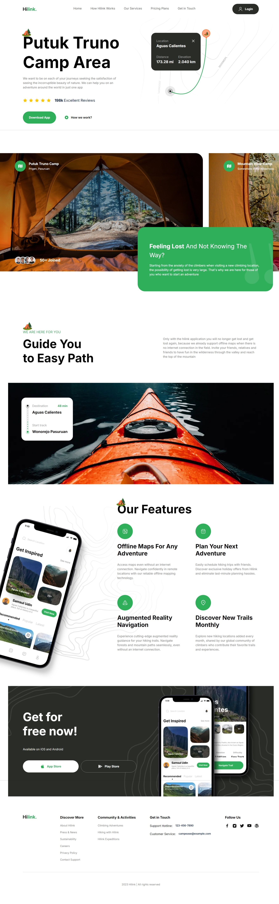

<div >
  <h3 >Travel Website</h3>

  <!-- <br /> -->
  <a href="https://youtu.be/cuzw4vL1z5E?feature=shared" target="_blank">
      
    </a>
  <br />

  <div>
    
    
    
  </div>


</div>

## <a name="introduction">🤖 Introduction</a>

Built with Next.js, TailwindCSS, and TypeScript, this landing page not only looks great but also serves as a hands-on project to reinforce one's understanding of these technologies.


## <a name="tech-stack">⚙️ Tech Stack</a>

- Next.js
- Tailwind CSS

## <a name="featuress">🔋 Features</a>
👉 **Eye-Catching Hero Section**: A visually impressive hero area designed to grab attention and establish the website's theme.  

👉 **Camp Discovery Section**: A dedicated space showcasing various camps, enabling users to browse and explore different options.  

👉 **Immersive Travel Guide Section**: An engaging travel guide featuring informative content and captivating visuals.  

👉 **Advanced Feature Section**: A comprehensive section packed with advanced functionalities or detailed insights.  

👉 **Mobile App Call-to-Action**: A dedicated section prompting users to check out the mobile app version, including download links.  

👉 **Comprehensive Footer**: A well-structured footer with site navigation and social media links for seamless connectivity.  

Plus much more, including optimized code architecture and reusability.

## <a name="quick-start">🤸 Quick Start</a>

Follow these steps to set up the project locally on your machine.

**Prerequisites**

Make sure you have the following installed on your machine:

- [Git](https://git-scm.com/)
- [Node.js](https://nodejs.org/en)
- [npm](https://www.npmjs.com/) (Node Package Manager)

**Cloning the Repository**

```bash
git clone https://github.com/mishodzuliashvili/travel_ui_ux.git
cd travel_ui_ux
```

**Installation**

Install the project dependencies using npm:

```bash
npm install
```

**Running the Project**

```bash
npm run dev
```

Open [http://localhost:3000](http://localhost:3000) in your browser to view the project.
